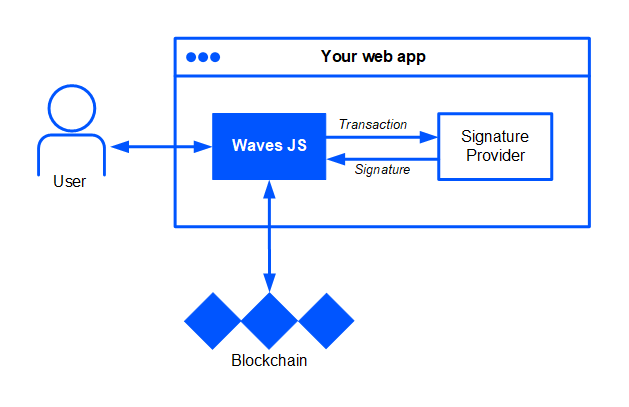

# Waves JS API

* [Overview](#overview)
* [Getting Started](#getting-started)
* [Constructor](#constructor)
* [Methods](#methods)

<a id="overview"></a>
## Overview

Waves JS API is a TypeScript/JavaScript component for your web app for interacting with the Waves blockchain. Using Waves JS API you can easily create and sign transactions.

Waves JS API uses external Provider library to authenticate users with their accounts and to get their signatures of transactions and arbitrary messages. Your web app and Waves JS API itself do not have access to user's private key and SEED phrase.



For now, you can use one of the following Providers:

* Test Provider built-in Waves JS API creates test account from SEED. TestProvider can be used at the app debugging stage.
* Storage Provider developed by Waves.Exchange is the wallet software that encryptes and stores user's private key and SEED phrase, making sure that users' funds are protected from hackers and malicious websites. Completion of a transaction doesn't require entering any sensitive information.

In code you can use [TypeScript types](https://github.com/wavesplatform/ts-types/blob/master/transactions/index.d.ts).

<a id="getting-started"></a>
## Getting Started

### 1. Provider SDK installation

To install Waves JS, use

```
npm i @waves/waves-js
```

To install Storage Provider developed by Waves.Exchange, use

```
npm i @waves.exchange/storage-provider -S
```

### 2. Library initialization

Add library initialization to you app.

* For Testnet & TestProvider:

   ```js
   import Waves from '@waves/waves-js';
   import { TestProvider } from '??';
   import { libs } from '@waves/waves-transactions';
   import { CHAIN_ID, NODE_URL, STATE } from './_state';

   const seed = libs.crypto.randomSeed();
   const address = libs.crypto.address(seed, CHAIN_ID);
   const publicKey = libs.crypto.publicKey(seed);
   ```

* For Testnet & Waves.Exchange Storage Provider:

   ```js
   import Waves from '@waves/waves-js';
   import Provider from '@waves.exchange/storage-provider';
   
   const waves = new Waves({
     // Specify URL of the node on Testnet
     NODE_URL: 'https://pool.testnet.wavesnodes.com'
   });
   waves.setProvider(new Provider());
   ```

* For Mainnet & Waves.Exchange Storage Provider:

   ```js
   import Waves from '@waves/waves-js';
   import Provider from '@waves.exchange/storage-provider';
   
   const waves = new Waves();
   waves.setProvider(new Provider());
   ```

After that you will be able to use Signer API features in the app.

### 3. Basic example

Now your application is ready to work with Waves Platform. Let's test it by implementing basic functionality. For example, we could try to authenticate user login, get his/her balances and transfer funds.

```js
it('Login', async () => {
    const waves = new Waves({ NODE_URL: NODE_URL });
    const provider = new TestProvider(seed);
    await waves.setProvider(provider);

it('Login', async () => {
    const waves = new Waves({ NODE_URL: NODE_URL });
    const provider = new TestProvider(seed);
    await waves.setProvider(provider);

    const user = await waves.login();
    expect(user.address).toBe(address);
    expect(user.publicKey).toBe(publicKey);
});

it('Get balances empty', async () => {
    const waves = new Waves({ NODE_URL: NODE_URL });
    const provider = new TestProvider(seed);
    await waves.setProvider(provider);

    await waves.login();
    const balances = await waves.getBalance();
    expect(balances.length).toBe(1);
    expect(balances[0].assetId).toBe('WAVES');
    expect(balances[0].amount).toBe('0');
});

```

<a id="constructor"></a>
## Constructor

```js
new Waves({
  NODE_URL: 'string',
  POLL_INTERVAL: number,
  MATCHER_URL: 'string',
 }): Waves
```

Creates an object that features the following [methods](#methods).

Parameters:

| Parameter | Default value | Description |
| :--- | :--- | :--- |
| NODE_URL | https://nodes.wavesnodes.com | Node that is used to access a blockchain |
| POLL_INTERVAL |  | Node that is used to access a blockchain |
| MATCHER_URL | https://matcher.waves.exchange/ | Matcher that is used to serve orders |

<a id="methods"></a>
## Methods

* [alias](#alias)
* [batch](#batch)
* [broadcast](#broadcast)
* [burn](#burn)
* [cancelLease](#cancellease)
* [data](#data)
* [exchange](#exchange)
* [getBalance](#getbalance)
* [getSponsoredBalances](#getsponsoredbalances)
* [invoke](#invoke)
* [issue](#issue)
* [lease](#lease)
* [login](#login)
* [logout](#logout)
* [make](#make)
* [massTransfer](#masstransfer)
* [off](#off)
* [on](#on)
* [once](#once)
* [reissue](#reissue)
* [setAssetScript](#setassetscript)
* [setProvider](#setprovider)
* [setScript](#setscript)
* [signMessage](#signmessage)
* [signTx](#signtx)
* [signTypedData](#signtypeddata)
* [sponsorship](#sponsorship)
* [transfer](#transfer)
* [waitTxConfirm](#waittxconfirm)


### User info

<a id="login"></a>
#### login

Description

```js
```

**Parameters:**

| Field name | Type | Description |
| :--- | :--- | :--- |

**Returns:** ???

**Usage:**
```ts
```

**Output example:**

```js
{
}
```

<a id="logout"></a>
#### logout

Description

```js
```

**Parameters:**

| Field name | Type | Description |
| :--- | :--- | :--- |

**Returns:** ???

**Usage:**
```ts
```

**Output example:**

```js
{
}
```

<a id="getbalance"></a>
#### getBalance

If user is authenticates, prodives balances of assets in user's portfolio.

    /**
     * Получаем список балансов пользователя (необходимо выполнить login перед использованием)
     * Basic usage example:
     *
     */
**Parameters:**

| Field name | Type | Description |
| :--- | :--- | :--- |

**Returns:** ???

**Usage:**
```ts
await waves.getBalance();
```

**Output example:**

```js
{
  public
}
```

<a id="getsponsoredbalances"></a>
#### getSponsoredBalances

Description

```js
```

**Parameters:**

| Field name | Type | Description |
| :--- | :--- | :--- |

**Returns:** ???

**Usage:**
```ts
```

**Output example:**

```js
{
}
```

### Create transactions

The following methods only create transactions but do not sign or broadcast them:

* [alias](#alias)
* [burn](#burn)
* [cancelLease](#cancellease)
* [data](#data)
* [exchange](#exchange)
* [invoke](#invoke)
* [issue](#issue)
* [lease](#lease)
* [massTransfer](#masstransfer)
* [reissue](#reissue)
* [setAssetScript](#setassetscript)
* [setScript](#setscript)
* [sponsorship](#sponsorship)
* [transfer](#transfer)

To sign transaction use [sign](#sign) method. For example:

```js
waves.invoke({
   dApp: address,
   call: { function: name, args: convertedArgs },
}).sign().then(t => console.log(t));
```

To sign transaction and immediately send it to bloackchain use [broadcast](#broadcast) method. For example:

```js
waves.invoke({
   dApp: address,
   call: { function: name, args: convertedArgs },
}).broadcast().then(t => console.log(t));
```

#### Common fields

Each create transaction method has optional fields that you don't specify manually in most cases:

| Field name | Description | Default value |
| :--- | :--- | :--- |
| chainId | 'W'.charCodeAt(0) or 87 means Mainnet<br/>'T'.charCodeAt(0) or 84 means Testnet |Defined by configuration of Waves node that is set in [Constructor](#constructor) | Defined by configuration of Waves node that is set in [Constructor](#constructor) |
| fee | Transaction fee | Calculated automatically as described in [Transaction fee](https://docs.wavesplatform.com/en/blockchain/transaction/transaction-fee.html) section |
| proofs | Array of transaction signatures | Added by `sign` or `broadcast` method (see [Intro](#intro)). If you specify a proof manually, it is also added to the array |
| senderPublicKey | Base58-encoded public key of transaction sender | Returned by [login](#login) method |

<a id="alias"></a>
#### alias

Creates [alias transaction](https://docs.wavesplatform.com/en/blockchain/transaction-type/alias-transaction.html).

```js
alias(data: {
  alias: 'string'
})
```

**Parameters:**

| Field name | Default value | Description |
| :--- | :--- | :--- |
| alias* | | Short and easy to remember name of address. See [Alias](https://docs.wavesplatform.com/en/blockchain/account/alias.html) for more information |

\* Required field

See [Common fields](#common-fields) for optional fields description.

**Returns:** Promise of ???

**Usage:**

```js
const data = {
  alias: 'new_alias',
}

const [tx] = await waves
  .alias(data)
  .broadcast();
```

**Output example:**

```js
```

<a id="burn"></a>
#### burn

Creates [burn transaction](https://docs.wavesplatform.com/en/blockchain/transaction-type/burn-transaction.html).

```js
burn(data: {
    assetId*: 'string',
    quantity*: LONG,
})
```


**Parameters:**

| Field name | Default value | Description |
| :--- | :--- | :--- |
| assetId* | | Base58-encoded id of the asset to burn |
| quantity* | | Amount of asset multiplied by 10^`decimals`. For example, decimals of WAVES is 8, so the real amount is multipied by 10^8. `{ "WAVES": 677728840 }` means 6.77728840 |

\* Required field.

See [Common fields](#common-fields) for optional fields description.

**Returns:** Promise of ???


**Usage:**

```js
const data = {
  assetId: '4uK8i4ThRGbehENwa6MxyLtxAjAo1Rj9fduborGExarC',
  quantity: 100,
}

const [tx] = await waves
  .burn(data)
  .broadcast();
```

<a id="cancellease"></a>
#### cancelLease

Creates [lease cancel transaction](https://docs.wavesplatform.com/en/blockchain/transaction-type/lease-cancel-transaction.html).

```js
cancelLease(data: {
    leaseId: 'string',
})
```

**Returns:** Promise of ???

**Parameters:**

| Field name | Default value | Description |
| :--- | :--- | :--- |
| leasetId* | | Id of the lease transaction |

\* Required field.

See [Common fields](#common-fields) for optional fields description.

**Usage:**

```js
const data = {
  leaseId: '69HK14PEHq2UGRfRYghVW8Kc3487uJaoUmk2ntT4kw7X',
}

const [tx] = await waves
  .cancelLease(data)
  .broadcast();
```

<a id="data"></a>
#### data

Creates [data](https://docs.wavesplatform.com/en/blockchain/transaction-type/data-transaction.html) transaction.

```js
data(data: [{
  key: 'string',
  type: 'string' | 'integer' | 'binary' | 'boolean',
  value: 'string' | number | boolean | Uint8Array | Array<number>,
])
```

or

```js
data(data: [{
  key: 'string',
  value: 'string' | number | boolean | Uint8Array | number[],
}])
```

Почему в одном случае Array\<number\>>, в другом number []? Надо ли отдельно описать Uint8Array, возможно достаточно number?

**Returns:** Promise of ???

**Parameters:**

| Field name | Default value | Description |
| :--- | :--- | :--- |
| key* | | Key of a record. Maximum of 100 characters |
| type | | Type of a record |
| value* | | Value of a record. Maximum of 5 Kbytes |

\* Required field.

See [Common fields](#common-fields) for optional fields description.

**Usage:**

```js
const data = [
  { key: 'name', type: 'string', value: 'Lorem ipsum dolor sit amet' },
  { key: 'value', type: 'number', value: 1234567 },
  { key: 'flag', type: 'boolean', value: true }
]

const [tx] = await waves
  .data(data)
  .broadcast();
```

<a id="exchange"></a>
#### exchange

Creates [exchange](https://docs.wavesplatform.com/en/blockchain/transaction-type/data-transaction.html) transaction.

```js
exchange(data: {
  buyOrder: IExchangeTransactionOrder<LONG> & IWithProofs (??),
  sellOrder: IExchangeTransactionOrder<LONG> & IWithProofs,
  price: LONG,
  amount: LONG,
  buyMatcherFee: LONG,
  sellMatcherFee: LONG,
})
```

**Parameters:**

| Field name | Default value | Description |
| :--- | :--- | :--- |
| buyOrder* | | Key of a record. Maximum of 100 characters |
| sellOrder* | | Type of a record |
| price* | | Value of a record. Maximum of 5 Kbytes |
| amount* | | Value of a record. Maximum of 5 Kbytes |
| buyMatcherFee* | | Value of a record. Maximum of 5 Kbytes |
| sellMatcher* | | Value of a record. Maximum of 5 Kbytes |

\* Required field.

See [Common fields](#common-fields) for optional fields description.

**Returns:** Promise of ???

**Usage:**

```js
const data = {}

const [tx] = await waves
  .exchange(data)
  .broadcast();
```

<a id="invoke"></a>
#### invoke

Creates [invoke scipt transaction](https://docs.wavesplatform.com/en/blockchain/transaction-type/invoke-script-transaction.html).

```js
invoke(data: {
  dApp: 'string',
  fee: LONG,
  payment: [{
    assetId: 'string',
    amount: LONG,
  }],
  call: {
    function: 'string',
    args: [{
      type: 'integer' | 'string' | 'binary',
      value: number | 'string',
    }],
  },
})
```

**Parameters:**

| Field name | Default value | Description |
| :--- | :--- | :--- |
| dApp* | | Base58-encoded address or alias of the dApp whose script should be invoked |
| fee* | | Transaction fee that depends on number of action performed by called function |
| payment | | Payments attached to the transaction. Maximum of two payments. |
| payment.assetId* | | Base58-encoded id of the asset to pay. `WAVES` or `null` means WAVES |
| payment.amount* | | Amount of asset multiplied by 10^`decimals`. For example, decimals of WAVES is 8, so the real amount is multipied by 10^8. `{ "WAVES": 677728840 }` means 6.77728840 |
| call | ?? Если не указано то что? |  |
| call.function* | | Name of the function that is called |
| call.args* | | Arguments for the function  that is called |
| call.args.type* | | Type of argument |
| call.args.value* | | Value of argument |

\* Required field

See [Common fields](#common-fields) for optional fields description.

**Returns:** Promise of ???

**Usage:**
```ts
const data = {
  dApp: '3Fb641A9hWy63K18KsBJwns64McmdEATgJd',
  fee: 1000000,
  payment: [{
    assetId: '73pu8pHFNpj9tmWuYjqnZ962tXzJvLGX86dxjZxGYhoK',
    amount: 7,
  }],
  call: {
    function: 'foo',
    args: [
      { type: 'integer', value: 1 },
      { type: 'binary', value: 'base64:AAA=' },
      { type: 'string', value: 'foo' }
    ],
  },
}

const [tx] = await waves
  .invoke(data)
  .broadcast();
```

**Output example:**

```js
{
}
```

<a id="issue"></a>
#### issue

Creates [issue transaction](https://docs.wavesplatform.com/en/blockchain/transaction-type/issue-transaction.html).

```js
issue(data: {
  name: 'string',
  decimals: 'number',
  quantity: LONG,
  reissuable: boolean,
  description: 'string',
  script: 'string',
})
```

**Parameters:**

| Field name | Default value | Description |
| :--- | :--- | :--- |
| name* | | Asset name |
| decimals* | | Number of digits in decimal part |
| quantity* | | Amount of asset multiplied by 10^`decimals` |
| reissuable* | | `true` – asset reissue is possible.<br>`false` — asset reissue is not possible |
| description* | | Asset description |
| script | | ?? Base64-encoded script to be attached to to asset |

\* Required field

See [Common fields](#common-fields) for optional fields description.

**Returns:** Promise of ???

**Usage:**

```js
const data = {
  name: 'MyToken',
  decimals: 8,
  quantity: 100000000000,
  reissuable: true,
  description: 'It is a gaming token',
}

const [tx] = await waves
  .issue(data)
  .broadcast();
```

**Output example:**

```js
???
```

<a id="lease"></a>
#### lease

Creates [lease transaction](https://docs.wavesplatform.com/en/blockchain/transaction-type/lease-transaction.html).

```js
lease(data: {
    amount: LONG,
    recipient: 'string',
})
```

**Parameters:**

| Field name | Default value | Description |
| :--- | :--- | :--- |
| amount* | | Amount of WAVES multiplied by 10^8. For example, `{ "WAVES": 677728840 }` means 6.77728840 |
| recipient* | | Base58-encoded [address](https://docs.wavesplatform.com/en/blockchain/account/address.html) of the recipient |

\* Required field

See [Common fields](#common-fields) for optional fields description.

**Returns:** Promise of ???

**Usage:**

```js
const data = {
    amount: 10000,
    recipient: '3P8pGyzZL9AUuFs9YRYPDV3vm73T48ptZxs',
}

const [tx] = await waves
  .lease(data)
  .broadcast();
```

**Output example:**

```js
```

<a id="masstransfer"></a>
#### massTransfer

Creates [mass transfer transaction](https://docs.wavesplatform.com/en/blockchain/transaction-type/mass-transfer-transaction.html).

```js
massTransfer(data: {
  assetId: 'string',
  transfers: [{
    amount: LONG,
    recipient: 'string',
  }],
  attachment: 'string',
})
```

**Parameters:**

| Field name | Default value | Description |
| :--- | :--- | :--- |
| assetId | WAVES | Base58-encoded ID of the asset to transfer |
| transfers | | List of transfers |
| transfers.amount* | | Amount of asset multiplied by 10^`decimals`. For example, decimals of WAVES is 8, so the real amount is multipied by 10^8. `{ "WAVES": 677728840 }` means 6.77728840Amount of  multiplied by 10^8. |
| transfers.recipient* | | Base58-encoded [address](https://docs.wavesplatform.com/en/blockchain/account/address.html) of the recipient |
| attachment | | Optional data attached to the transaction. This field is often used to attach a comment to the transaction. The maximum data size is 140 bytes |

\* Required field

See [Common fields](#common-fields) for optional fields description.

**Returns:** Promise of ???

**Usage:**

```js
const data = [
    {
      amount: 100,
      recipient: '3P23fi1qfVw6RVDn4CH2a5nNouEtWNQ4THs',
    },
    {
      amount: 200,
      recipient: '3PPnqZznWJbPG2Z1Y35w8tZzskiq5AMfUXr',
    },
]

const [tx] = await waves
  .massTransfer(data)
  .broadcast();
```

**Output example:**

```js
```

<a id="reissue"></a>
#### reissue

Creates [reissue transaction](https://docs.wavesplatform.com/en/blockchain/transaction-type/reissue-transaction.html).

```js
reissue(data: {
  assetId: 'string',
  quantity: LONG,
  reissuable: boolean,
})
```

**Parameters:**

| Field name | Default value | Description |
| :--- | :--- | :--- |
| assetId* | | Base58-encoded ID of the asset to reissue |
| quantity* | | Amount of asset multiplied by 10^`decimals` to reissue |
| reissuable* | | `true` – asset reissue is possible.<br>`false` — asset reissue is not possible |

\* Required field

See [Common fields](#common-fields) for optional fields description.

**Returns:** Promise of ???

**Usage:**

```js
const data = {
  assetId: 'AcrRM9STdBu5PNiFveTCbRFTS8tADhKcsbC2KBp8A4tx'
  quantity: 100000000000,
  reissuable: true,
}

const [tx] = await waves
  .reissue(data)
  .broadcast();
```

<a id="setassetscript"></a>
#### setAssetScript

Creates [set asset script transaction](https://docs.wavesplatform.com/en/blockchain/transaction-type/set-asset-script-transaction.html).

```js
setAssetScript(data: {
  assetId: 'string',
  script: 'string',
})
```

**Parameters:**

| Field name | Default value | Description |
| :--- | :--- | :--- |
| assetId* | | Base58-encoded ID of the asset |
| script | | Base64-encoded script to be attached to the asset |

\* Required field

See [Common fields](#common-fields) for optional fields description.

**Returns:** Promise of ???

**Usage:**

```js
const data = {
  assetId: 'AcrRM9STdBu5PNiFveTCbRFTS8tADhKcsbC2KBp8A4tx',
  script: 'base64:AwZd0cYf',
}

const [tx] = await waves
  .setAssetScript(data)
  .broadcast();
```

**Output example:**

```js
```

<a id="setscript"></a>
#### setScript

Creates [set script transaction](https://docs.wavesplatform.com/en/blockchain/transaction-type/set-script-transaction.html).

```js
setScript(data: {
  script: 'string',
})
```

**Parameters:**

| Field name | Default value | Description |
| :--- | :--- | :--- |
| script | | Base64-encoded [account script](https://docs.wavesplatform.com/en/ride/script/script-types/account-script.html) or [dApp script](https://docs.wavesplatform.com/en/ride/script/script-types/dapp-script.html) to be attached to the user account. `null` means cancelling the script |

See [Common fields](#common-fields) for optional fields description.

**Returns:** Promise of ???

**Usage:**

```js
const data = {
  script: 'base64:AAIDAAAAAAAAAAQIARIAAAAAAAAAAA...',
}

const [tx] = await waves
  .setScript(data)
  .broadcast();
```

<a id="sponsorship"></a>
#### sponsorship

Creates sponsorship transaction.

```js
sponsorship(data: {
    assetId: 'string',
    minSponsoredAssetFee: LONG,
})
```

**Parameters:**

| Field name | Default value | Description |
| :--- | :--- | :--- |
| assetId* | | Base58-encoded ID of the asset |
| minSponsoredAssetFee | | Required amount of sponsored token to be charged to users multiplied by 10^`decimals` |
\* Required field

See [Common fields](#common-fields) for optional fields description.

**Returns:** Promise of ???

**Usage:**

```js
const data = {
  assetId: 'AcrRM9STdBu5PNiFveTCbRFTS8tADhKcsbC2KBp8A4tx',
  minSponsoredAssetFee: 314,
}

const [tx] = await waves
  .sponsorship(data)
  .broadcast();
```

<a id="transfer"></a>
#### transfer

Creates [transfer transaction](https://docs.wavesplatform.com/en/blockchain/transaction-type/transfer-transaction.html).

```js
transfer(data: {
  recipient: 'string',
  amount: LONG,
  assetId: 'string',
  attachment: 'string',
  feeAssetId: 'string',
})
```

**Parameters:**

| Field name | Default value | Description |
| :--- | :--- | :--- |
| recipient* | | Base58-encoded [address](https://docs.wavesplatform.com/en/blockchain/account/address.html) of the recipient |
| amount* | | Amount of asset multiplied by 10^`decimals`. For example, decimals of WAVES is 8, so the real amount is multipied by 10^8. `{ "WAVES": 677728840 }` means 6.77728840 |
| assetId | WAVES | Base58-encoded ID of the asset to transfer. `null` or omitted field means WAVES |
| attachment | | Optional data attached to the transaction. This field is often used to attach a comment to the transaction. The maximum data size is 140 bytes |
| feeAssetId | WAVES | Base58-encoded ID of the asset to pay the commission. `null` or omitted field means WAVES |

\* Required field

See [Common fields](#common-fields) for optional fields description.

**Returns:** Promise of ???

**Usage:**

```js
const data = {
  script: 'base64:AAIDAAAAAAAAAAQIARIAAAAAAAAAAA...',
}

const [tx] = await waves
  .transfer(data)
  .broadcast();
```

### Others

<a id="batch"></a>
#### batch

Signs transations and send them to the blockchain.

```js
batch(txOrList)
```

**Parameters:**

| Field name | Default value | Description |
| :--- | :--- | :--- |
| txOrList* | | Transaction or list of transaction |

\* Required field

**Usage:**

```js
??
```

**Output example:**

<a id="broadcast"></a>
#### broadcast

Sends transactions that are already signed to the blockchain.

```js
broadcast(tx,[options])
```

```js
broadcast(list: T[],[options])
```

**Returns:** Promise of ???

**Parameters:**

| Field name | Default value | Description |
| :--- | :--- | :--- |
| tx* | | Signed transaction |
| list* | | Signed transaction |
| options.retry | ?? | Number of attemps to send each transaction to blockchain (in case of fail) |
| options.chain | false | [Type: boolean] Send the next transaction only after the previous transaction put in the blockchain |
| options.confirmations | -1 | Number of confirmations after that the Promise is resolved |

\* One of `tx`, `list` is required.

Но ведь транзакция уже подписана?? учитывается ли первая подпись в количестве подтверждений?

**Usage:**

```js

```

**Output example:**

<a id="make"></a>
#### make

Description

```js
```

**Parameters:**

| Field name | Type | Description |
| :--- | :--- | :--- |

**Returns:** ???

**Usage:**
```ts
```

**Output example:**

```js
{
}
```

<a id="off"></a>
#### off

Description

```js
```

**Parameters:**

| Field name | Type | Description |
| :--- | :--- | :--- |

**Returns:** ???

**Usage:**
```ts
```

**Output example:**

```js
{
}
```

<a id="on"></a>
#### on

Description

```js
```

**Parameters:**

| Field name | Type | Description |
| :--- | :--- | :--- |

**Returns:** ???

**Usage:**
```ts
```

**Output example:**

```js
{
}
```

<a id="once"></a>
#### once

Description

```js
```

**Parameters:**

| Field name | Type | Description |
| :--- | :--- | :--- |

**Returns:** ???

**Usage:**
```ts
```

**Output example:**

```js
{
}
```

<a id="setprovider"></a>
#### setProvider

Description

```js
```

**Parameters:**

| Field name | Type | Description |
| :--- | :--- | :--- |

**Returns:** ???

**Usage:**
```ts
```

**Output example:**

```js
{
}
```

<a id="signmessage"></a>
#### signMessage

Description

```js
```

**Parameters:**

| Field name | Type | Description |
| :--- | :--- | :--- |

**Returns:** ???

**Usage:**
```ts
```

**Output example:**

```js
{
}
```

<a id="signtx"></a>
#### signTx

Description

```js
```

**Parameters:**

| Field name | Type | Description |
| :--- | :--- | :--- |

**Returns:** ???

**Usage:**
```ts
```

**Output example:**

```js
{
}
```

<a id="signtypeddata"></a>
#### signTypedData

Description

```js
```

**Parameters:**

| Field name | Type | Description |
| :--- | :--- | :--- |

**Returns:** ???

**Usage:**
```ts
```

**Output example:**

```js
{
}
```


<a id="waittxconfirm"></a>
#### waitTxConfirm

Description

```js
```

**Parameters:**

| Field name | Type | Description |
| :--- | :--- | :--- |

**Returns:** ???

**Usage:**
```ts
```

**Output example:**

```js
{
}
```
